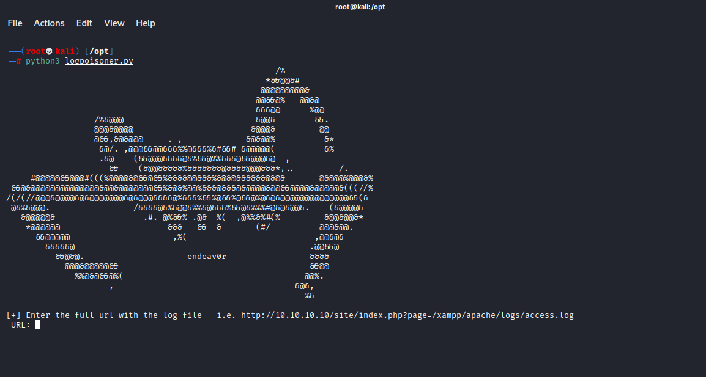

# Web-LogPoison
Python script to help automate performing log file poisoning from various sources (web, ssh, mail logs, etc.)

# How to Use
Once you are able to view logs from the LFI vulnearbility, simply copy the URL (do not include http(s)://) into the tool as the parameter and logpoisoner will attempt to poison the log file for code execution.

# Sample

