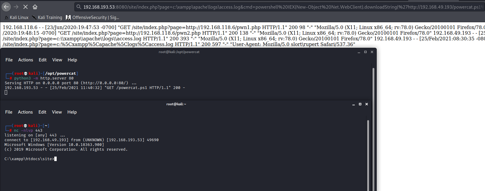

# Web-LogPoison
Python script to help automate performing log file poisoning from web logs.
View the full blog post about this tool here: https://endeav0r.medium.com/automating-web-log-file-poisoning-with-logpoisoner-5477fc1e0f9f

# How to Use
Once you are able to view logs from the LFI vulnearbility, simply copy the URL into the tool as the parameter and logpoisoner will attempt to poison the log file for code execution.

# Sample
When you start the script, it is expecting the full URL.

# Poison the Log File
Once you have the URL, simply paste it in, and logpoisoner will attemp to poison the log file

# RCE with LogPoisoner
Once we have basic commands executed, we can pull down powercat to retreive a reverse shell

